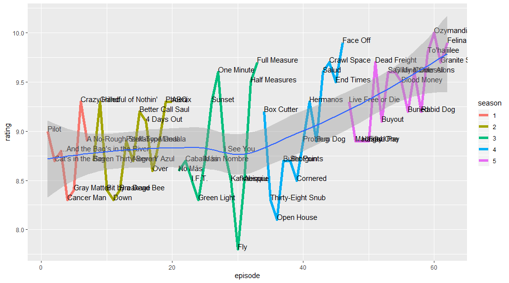
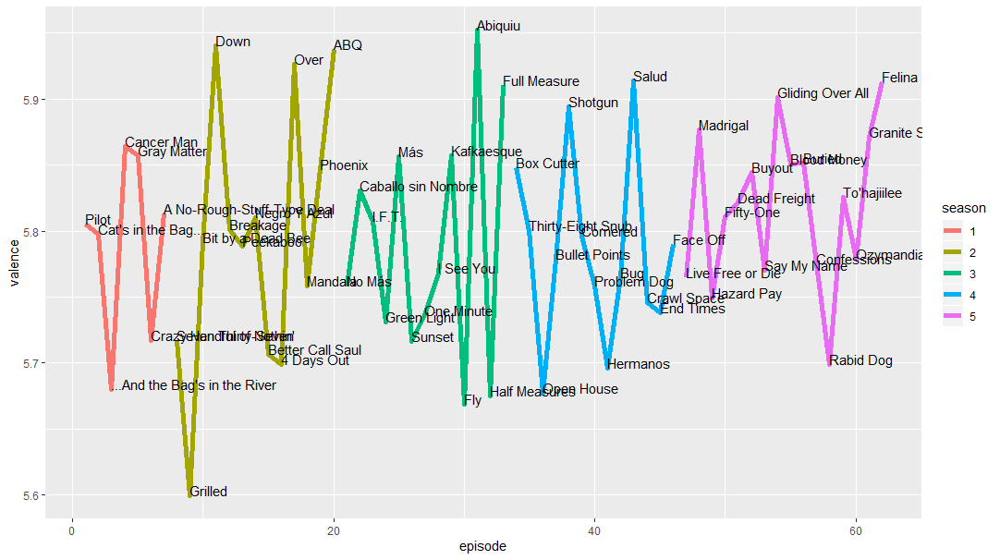
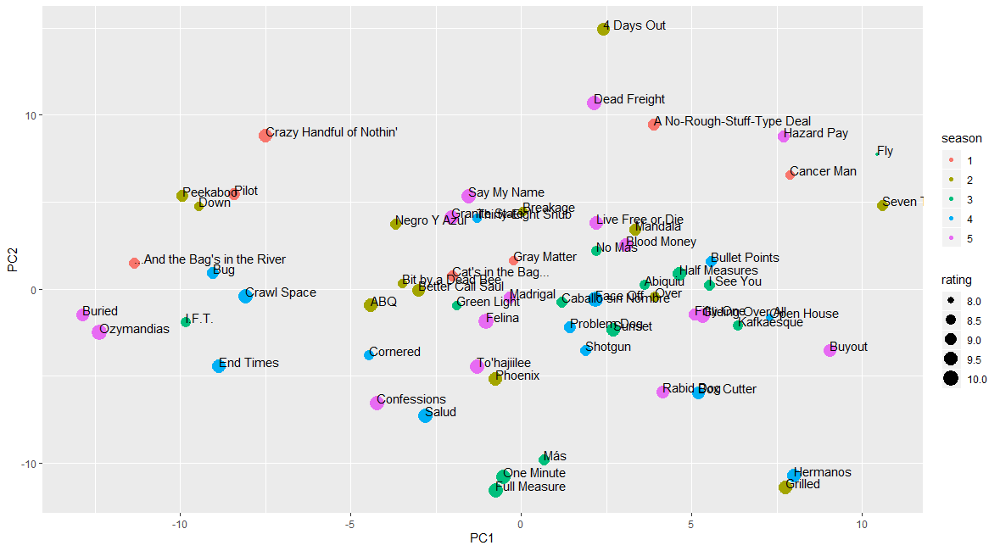

# Analyzing Breaking Bad transcripts with the textfeats package

<br>

The data was scraped and compiled by me and is available in data/breaking_bad.csv

A full analysis is located in analysis.R. But, before we do any language analysis, we can look at the ratings across all 62 Breaking Bad episodes:



<br>

## Analyzing the valence (positivity/negativity) in Breaking Bad

We can load in the data and use four functions from my textfeats package to build a set of text features for each of 62 Breaking Bad episodes:

```r
data <- read.csv("data/breaking_bad.csv", stringsAsFactors = FALSE)
data <- data.frame(episode=1:62,
                   data, 
                   count(data$text),
                   warriner(data$text),
                   concreteness(data$text),
                   pos(data$text))
data$season <- as.factor(data$season)
data <- data[ , apply(data, 2, function(x){!all(x == 0)})]
```
Now we can plot the data using ggplot2:

```r
ggplot(data, aes(episode, valence)) + geom_line(size=2, aes(color=season)) + 
    geom_text(aes(label=title),hjust=0, vjust=0)
```


There's an interesting saw-tooth pattern in emotionality from episode to episode that I think might be indicative of good drama writing.

<br>

## Building semantic spaces to visualize episode similarity

We can use the semantics function from my textfeats package to build a set of word embeddings. Then, we can further reduce the dimensionality of the 300 dimensional vectors using PCA so that the transcript embdeddings can be visualized in two dimensions:

```r
sem <- semantics(data$text, TASA)
pca <- prcomp(sem, center = TRUE, scale. = TRUE)
sem <- pca$x[ , 1:2]
sem <- data.frame(data, sem)
```
We can visualize each transcript in a two dimensional semantic space. Here each transcript is represented by a point and semantically similar episodes occupy similar regions in the space:

```r
ggplot(sem, aes(PC1, PC2)) + geom_point(aes(color=season, size=rating)) + 
    geom_text(aes(label=title),hjust=0, vjust=0)
```


The points are colored according to season and are sized by their IMDb ratings. There appears to be some structure in the overall semantic content of episodes, with several clusters appearing from the same season and bizzare episodes like "Fly" occupying the perimeter of the space. Of course, a lot of information is lost in this two dimensional rendering compared to the full 300 dimensional episode space.

<br>
<br>
<br>
<br>
<br>
